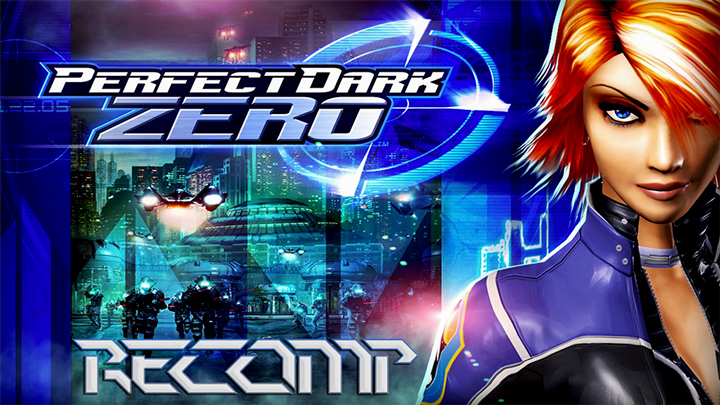

# PerfectDarkZeroRecomp

<div align="center">
  
</div>

A static recompilation of [**Perfect Dark Zero**](https://en.wikipedia.org/wiki/Perfect_Dark_Zero)
(Xbox 360, 2005, Title ID `4D5307D3`) to native PC, built on the
[ReXGlue SDK](https://github.com/rexglue/rexglue-sdk). The game's PowerPC code
is translated into C++ and compiled. There is no emulator.

> This project is not affiliated with Microsoft or Rare. It contains no game
> files: you need your own legally owned copy of the game.

## Status

- Fully playable on Windows: video, audio, gameplay, achievements and saves.
- Keyboard and mouse support.
- Optional patches: 60 FPS (on by default) and 16:9.
- Third-person camera mod: press **V** to toggle. See [`src/mod/README.md`](src/mod/README.md).

## Requirements

- CMake 3.25+, Ninja, and Clang/LLVM. MSVC alone won't build this.
- The game's files, extracted from your disc or ISO with
  [ABGX360](https://github.com/BakasuraRCE/abgx360) or
  [extract-xiso](https://github.com/XboxDev/extract-xiso/releases).

## Build

1. Clone the repo with its submodule. The ReXGlue SDK is built from source
   (`thirdparty/rexglue-sdk`).

   ```
   git clone --recursive https://github.com/nikolaygorb/PerfectDarkZeroRecomp.git
   ```

   If you already cloned without it, run `git submodule update --init --recursive`.
2. Copy the extracted game files into `assets/`, so the path is
   `assets/default.xex`. `assets/` is gitignored.
3. Build:

   ```
   cmake --preset win-amd64-release
   cmake --build --preset win-amd64-release
   ```

   There are also Linux and macOS presets (`linux-amd64-*`, `mac-*`), but only
   Windows is tested. Codegen (`default.xex` → `generated/`) runs automatically
   as part of the build.

Check that your dump is the expected retail release: XEX CRC `375EC9BB`,
Media ID `6D6481013A4FDD3DA32BD2D0-750FF1D9`.

## Run

```
out\build\win-amd64-release\perfectdarkzerorecomp.exe
```

Game files are found in `<repo>/assets` automatically; use `--game_data_root`
to point somewhere else. Logs go to `out\build\<preset>\logs\`.

## Configuration

All settings live in [`settings/`](settings/README.md) and are loaded at startup.
Most can also be changed in game from the F4 overlay.

| File | What it covers |
|---|---|
| `hardware.toml` | renderer, window, patches (`pdz_fps60_unlock`, `pdz_aspect_ratio_16_9`), `pdz_gpu_wait_mode`, third-person camera (`pdz_tp_*`) |
| `mapping.toml` | input backend, keyboard and mouse (`mnk_*`), key bindings including `bind_third_person` |

## Development notes

- Set `dev_debug_runtime = true` to stub every unknown function and log
  missing ones to `logs/stub_sweep.txt` and `logs/missed_functions.txt`.
- Game-specific hooks are in `src/`: patches, the GPU wait hook in `render/`,
  and the camera mod in `mod/`.

## Credits

- [ReXGlue SDK](https://github.com/rexglue/rexglue-sdk), whose runtime is
  derived from [Xenia](https://github.com/xenia-project/xenia)
- [xenia-canary/game-patches](https://github.com/xenia-canary/game-patches),
  the source of the 60 FPS and 16:9 patches
- [SDL_GameControllerDB](https://github.com/mdqinc/SDL_GameControllerDB),
  for `settings/gamecontrollerdb.txt` (zlib license)
- [ABGX360](https://github.com/BakasuraRCE/abgx360) and
  [extract-xiso](https://github.com/XboxDev/extract-xiso), for dumping the game

## License

MIT. See [LICENSE](LICENSE). This applies to this project's own code only, not
to the game or its assets.
