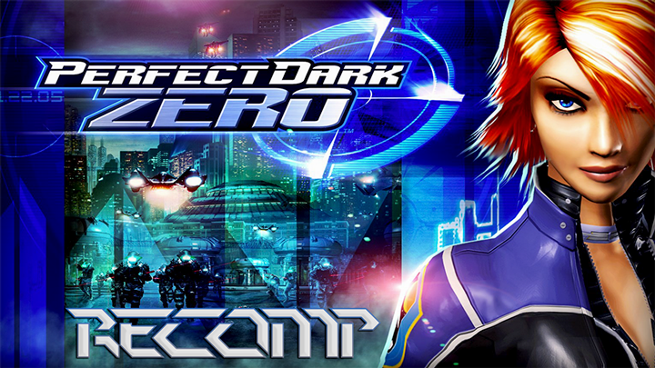

# PerfectDarkZeroRecomp

<div align="center">
  
</div>

A static recompilation of [**Perfect Dark Zero**](https://en.wikipedia.org/wiki/Perfect_Dark_Zero)
(Xbox 360, 2005, Title ID `4D5307D3`, **[PAL]**) to native PC, built on the
[ReXGlue SDK](https://github.com/rexglue/rexglue-sdk). The game's PowerPC code
is translated into C++ and compiled. There is no emulator.

Target retail release:

| Field | Value |
|---|---|
| Title ID | `4D5307D3` |
| XEX CRC | 375EC9BB |
| Module Hash | `AA1EA03FEC9A549C` |
| Media ID | `750FF1D9` |

> This project is not affiliated with Microsoft or Rare. It contains no game
> files: you need your own legally owned copy of the game.

## Status

- Fully playable on Windows and Linux: tested from the start of the campaign
  to the end credits. Video, audio, gameplay, achievements and saves work.
- Two renderers: the SDK's native Vulkan renderer (`gpu_plugin = "native"`, as
  shipped) and the Xenos GPU emulation (`gpu_plugin = "xenos"`: D3D12, Vulkan,
  D3D11) to fall back to.
- Upscalers and frame generation in the native renderer on Windows: AMD FSR
  3.1/4, Intel XeSS and NVIDIA DLSS (`native_temporal_upscaler`), AMD FSR and
  NVIDIA DLSS frame generation (`native_frame_generation`). The 3D scene is
  processed with its depth, motion (camera and moving objects) and jitter,
  while the HUD stays at full resolution. See [`settings/faq.md`](settings/faq.md).
- A launcher (`perfectdarkzerorecomp_launcher.exe`) for the main settings, see
  [Launcher](#launcher).
- Keyboard and mouse support, with native mouse look (`pdz_mouse_*` in
  `mapping.toml`), the mouse in menus, for the CamSpy, the guided rocket, the
  hovercraft, the jetpack and turrets, and the Locktopus on keyboard and mouse.
- Local split-screen for 4 players out of the box (`max_local_users = 4`), up
  to 4 players with gamepads. Keyboard and mouse can be one of the players, see
  [Split-screen](#split-screen).
- Optional patches: 60 FPS (on by default), 16:9 and skipping the intro
  (`pdz_skip_intro`, on by default).
- Fixes for frame rates above 30 FPS and Rare's Title Update 3 fixes on the
  launch executable, see [Fixes](#fixes).
- Third-person camera, up to 31 bots and language selection, see [Mods](#mods).

## Requirements

- CMake 3.25+, Ninja, and Clang/LLVM. MSVC alone won't build this.
- The game's files, extracted from your disc or ISO with
  [ABGX360](https://github.com/BakasuraRCE/abgx360) or
  [extract-xiso](https://github.com/XboxDev/extract-xiso/releases).

## Build

1. Clone the repo with its submodule. The ReXGlue SDK is built from source
   (`thirdparty/rexglue-sdk`).

   ```
   git clone --recursive https://github.com/nikolaygorb/PerfectDarkZeroRecomp.git
   ```

   If you already cloned without it, run `git submodule update --init --recursive`.
2. Copy the extracted game files into `assets/`, so the path is
   `assets/default.xex`. `assets/` is gitignored.
3. Build:

   ```
   cmake --preset win-amd64-release
   cmake --build --preset win-amd64-release
   ```

   There are also Linux, macOS and ARM64 presets (`linux-amd64-*`,
   `win-arm64-*`, `linux-arm64-*`, `mac-*`). Codegen (`default.xex` → `generated/`) runs automatically
   as part of the build.

## Run

```
out\build\win-amd64-release\perfectdarkzerorecomp.exe
```

Game files are found in `<repo>/assets` automatically; use `--game_data_root`
to point somewhere else. Logs go to `out\build\<preset>\logs\`.

### Launcher

```
out\build\win-amd64-release\perfectdarkzerorecomp_launcher.exe
```

Built with the game. Pick the main settings (display, renderer, upscaling,
controls, FoV, 60 FPS, 16:9, intro, third person, mouse) and press **Play**. It
edits `settings/hardware.toml` and `settings/mapping.toml` in place, so the game
started without it has the same settings. If the game crashes, the launcher
opens again with **Safe mode** (emulated renderer on Vulkan, scale 1, no
upscaler or anti-aliasing) and the logs. Its page for this game is
[`launcher/launcher.toml`](launcher/launcher.toml); the format is in the SDK's
`docs/launcher.md`.

## Mods

### Third-person camera

Press **V** in game to switch between first and third person. Set
`pdz_tp_enable = true` in `hardware.toml` to start in third person. Camera
offset and the rest of the options are in [`src/mod/README.md`](src/mod/README.md).

### Field of view

Press F6 to open the FoV slider (40–120 vertical degrees, original 58), with a
button to reset to the original value. Press F6 again to close it. You can also
edit `pdz_fov` in the F4 Settings overlay under Gameplay. Weapon zoom still works
at any FoV. To use another key, change `bind_fov_settings` in
`settings/mapping.toml`. Use **Save to config** to keep the value between sessions.

### Up to 31 bots

Offline multiplayer matches take up to 31 bots (32 players) instead of 15
(`pdz_bots_31`, on by default; applies when the match setup opens).

### Mouse in menus and vehicles

- **Menus** (`pdz_mouse_menu_pointer`): point at a button and left-click to
  select it, right-click goes back, middle-click is Start, side buttons are
  LB / RB, the wheel moves up / down (Shift: left / right).
- **Steering** (`pdz_mouse_steer`): the mouse steers the CamSpy, the guided
  rocket, the hovercraft and the jetpack, and aims mounted turrets directly.
- **Locktopus** (`pdz_locktopus_mnk`): the movement keys turn the pick round the
  circle and push it out / in, Shift slows it, the mouse moves it too.

All three are on by default; a controller works as before.

### Language

Set `user_language` in `hardware.toml` and restart the game:

```
# 1 = English, 3 = German, 4 = French
user_language = 1   
```

Only languages your copy of the game includes will work (check
`assets/pdz/ASSETS/loc/`). Anything else falls back to English.

### Split-screen

Set `max_local_users` in `hardware.toml` (1 to 4; the file ships with `4`).
Player 1 uses keyboard and mouse plus gamepad 1, player 2 signs in when a
second gamepad is connected, and players 3 and 4 follow with gamepads 3 and 4.

```
# Two players, one gamepad: keyboard and mouse against the pad
max_local_users = 2
keyboard_own_player = true
```

Each player keeps their own in-game options; saves are shared. Explicit device
assignment, player names and troubleshooting are in
[`settings/split-screen.md`](settings/split-screen.md).

### Local player profiles

Press **F9** to open the profile list. You can create profiles, rename them and
pick the one to play next time. Each profile has its own saves and achievements.
A new profile or name takes effect after you restart the game.

The first profile, "User", keeps the saves you already have. Other profiles
save to `profiles/<id>/` in the user data folder (`Documents/perfectdarkzerorecomp`
by default), so renaming a profile doesn't move its saves. The list is kept in
`local_profiles.toml` in that folder. Settings and the shader cache are shared.

Names are 1–15 characters: letters, digits, spaces, `-` and `_`. To use another
key, change `bind_local_profiles` in `settings/mapping.toml`.

## Fixes

All on by default, each with its own `pdz_fix_*` setting to turn it off (they
can be changed while the game runs; list in
[`settings/README.md`](settings/README.md#fixes)).

- **Above 30 FPS:** doors and other animated props open fully, Bridge's ship
  turret, gun idle fidgets, screen flicker, enemy semi-auto fire and Subway's
  taunts keep Rare's 30 FPS rate, and Subway's end-train ramp can be climbed.
- **Title Update 3:** Rare's later fixes on the launch executable (null checks
  in the Datacore and bot scripts, the Jungle health entry, flag drops,
  teleports, the Cover Move exploit).
- **Distant lights:** window lights far away no longer switch off when looked at
  head-on.

## Configuration

All settings live in [`settings/`](settings/README.md) and are loaded at startup.
Most can also be changed in game from the F4 overlay.

| File | What it covers |
|---|---|
| `hardware.toml` | renderer (`gpu_plugin`: `native`, `xenos`; `graphics_backend`: `any`, `d3d12`, `vulkan`, `d3d11` experimental), image quality, window, patches (`pdz_fps60_unlock`, `pdz_aspect_ratio_16_9`, `pdz_skip_intro`), field of view (`pdz_fov`), `pdz_gpu_wait_mode`, third-person camera (`pdz_tp_*`), language (`user_language`), split-screen (`max_local_users`, `keyboard_own_player`) |
| `mapping.toml` | input backend, keyboard and mouse (`mnk_*`), native mouse look (`pdz_mouse_*`), key bindings including `bind_third_person` and `bind_fov_settings` |

`pdz_fix_*`, `pdz_bots_31`, `pdz_mouse_menu_pointer`, `pdz_mouse_steer` and
`pdz_locktopus_*` aren't in the files (their defaults are on); add a line to
change one, or use the F4 overlay.

Every graphics option of the SDK is described in
[`settings/faq.md`](settings/faq.md); split-screen in
[`settings/split-screen.md`](settings/split-screen.md).

## Development notes

- Set `dev_debug_runtime = true` to stub every unknown function and log
  missing ones to `logs/stub_sweep.txt` and `logs/missed_functions.txt`.
- Game-specific hooks are in `src/`: patches, the GPU wait hook, the
  `graphics_backend` choice and native `memcpy`/`memset`/`memmove`
  (`native_memory`, on by default) in `render/`, mouse look, menu pointer,
  steering and Locktopus input in `mouse/`, high-FPS physics, cutscene timing,
  rate fixes and the ramp fix in `timing/`, Title Update 3, AI rate and distant
  light fixes in `fixes/`, the camera, FoV and bot limit mods in `mod/`, and
  local profiles in `local_profiles.cpp`. `guest_memory.h` holds the guest
  memory helpers they share.
- Mid-function hooks (a call in the middle of a game function) are listed in
  [`patches.toml`](patches.toml), included from the manifest; changing it
  re-runs codegen.

## Credits

- [ReXGlue SDK](https://github.com/rexglue/rexglue-sdk), whose runtime is
  derived from [Xenia](https://github.com/xenia-project/xenia)
- [xenia-canary/game-patches](https://github.com/xenia-canary/game-patches),
  the source of the 60 FPS and 16:9 patches
- [2023PerfectDark/Perfect-Dark-Zero-Reinstated](https://github.com/2023PerfectDark/Perfect-Dark-Zero-Reinstated),
  the source of the high-FPS physics and cutscene timing fixes, the menu
  pointer and the intro skip
- [EddieVanHelgen/PerfectDarkZeroRestored](https://github.com/EddieVanHelgen/PerfectDarkZeroRestored)
  (MIT), the source of the rate, ramp, AI, distant light and Title Update 3
  fixes, mouse steering, Locktopus input and the bot limit
- [Rajdhani](https://fonts.google.com/specimen/Rajdhani) (SIL Open Font
  License 1.1), the launcher's display font
- [SDL_GameControllerDB](https://github.com/mdqinc/SDL_GameControllerDB),
  for `settings/gamecontrollerdb.txt` (zlib license)
- [ABGX360](https://github.com/BakasuraRCE/abgx360) and
  [extract-xiso](https://github.com/XboxDev/extract-xiso), for dumping the game

## License

MIT. See [LICENSE](LICENSE). This applies to this project's own code only, not
to the game or its assets.
